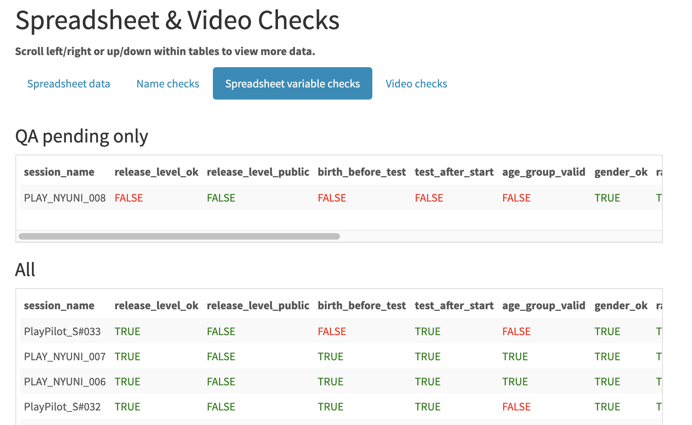

```{r setup, include=FALSE}
knitr::opts_chunk$set(echo = FALSE, fig.align='center', out.width='95%')
```

# Overview

Many fields of scientific research face daunting challenges of reproducibility. 
The science of infant development is no exception. 
We describe a set of free and open source software tools we have developed that support fully reproducible data collection, cleaning, visualization, and analysis workflows that are suitable for many types of developmental research.

# Case 1: PLAY Project

## Overview

The Play & Learning Across a Year (PLAY) project (<https://play-project.org>) is a collaborative research initiative by 65 researchers from 45 universities across the United States and Canada. 
PLAY focuses on recording and revealing the behaviors of infants and mothers during natural activity in their homes.

## Workflow

Figure \@ref(fig:play-overview) shows the project's multi-step workflow.

```{r play-overview, fig.cap='PLAY workflow'}
knitr::include_graphics("img/overview-project.png")
```

## Quality assurance (QA)

Data collection labs upload 1) videos and other documents to Databrary and 2) survey information to the KoBoToolbox server (<https://kobotoolbox.org>).
Staff then run an R script to check that all data were entered correctly.
Figures \@ref(fig:name-checks) and \@ref(fig:ss-checks) show some of the outputs.

```{r name-checks, fig.cap='Checking PLAY file names'}
knitr::include_graphics("img/file-name-checks.png")
```

```{r ss-checks, fig.cap='Checking PLAY spreadsheet data'}

```

# Case 2: Databrary

## Overview

Databrary (<https://databrary.org>) is a restricted access data library offering scientists a secure way to store and share identifiable research data, especially video and audio recordings.

Databrary has an application program interface (API).
Using an R or Python package, researchers can write **reproducible** code that gathers data from Databrary and visualizes or analyzes it.

## Charting Databrary's growth

Every week, the Databrary staff run an R script that generates an HTML-formatted report (see \@ref(fig:name-checks)) about the number of users, institutions, and new projects.

```{r databrary-weekly, fig.align='center', out.width='95%', fig.cap='Checking PLAY spreadsheet data'}
knitr::include_graphics("img/databrary-weekly.png")
```

# Conclusions

Using R, Python, GitHub, KoBoToolbox, Box, and Databrary, we are able to create reproducible workflows for complex projects like PLAY and Databrary.
Our code can be found on GitHub (REFERENCES), and we are happy to work with researchers who would like to make use of it.

```{r, include=FALSE}
knitr::write_bib(c('knitr','rmarkdown','posterdown','pagedown'), 'packages.bib')
```

# References

