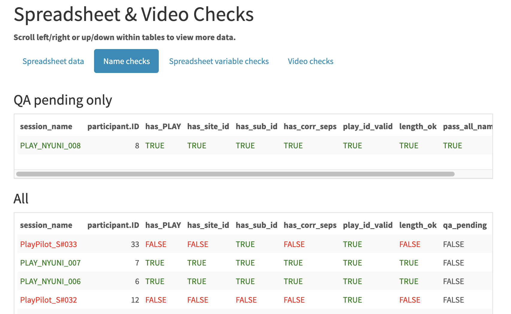
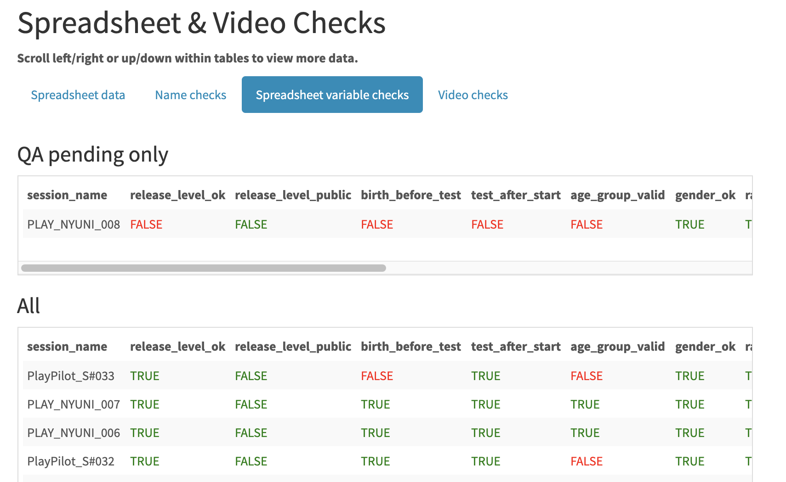
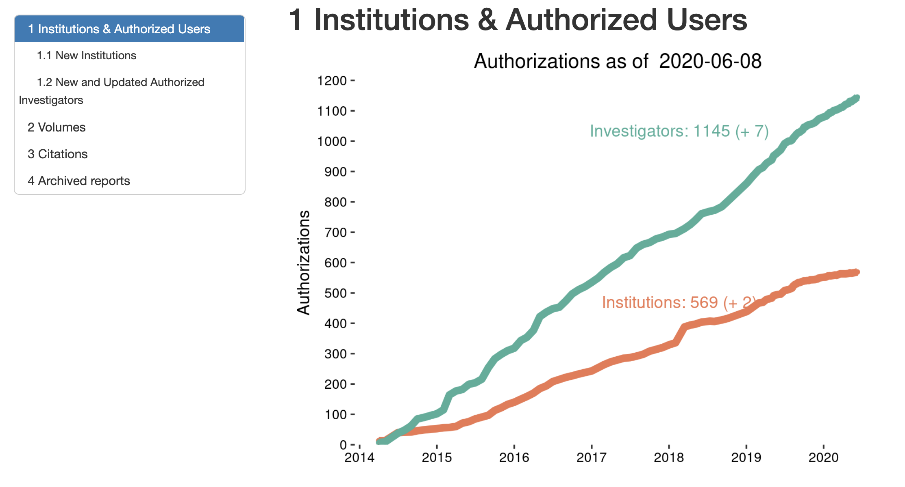

```{r setup, include=FALSE}
knitr::opts_chunk$set(echo = FALSE, fig.align = 'center')
```

## Overviews

- Open source software tools can enhance developmental research workflows
- Automation produces more robust and reproducible workflows
- R and Python scripts can knit together cloud data services with APIs

## Case 1: PLAY Project

- Play & Learning Across a Year (PLAY) project, <https://play-project.org>
- Collaborative research initiative -- 65 researchers from 45 universities in U.S. & Canada
- 1 hr video-recorded mother-infant interaction in home + ambient sound + surveys

---

```{r play-overview, fig.cap='PLAY workflow', out.height='35%'}
knitr::include_graphics("img/overview-project.png")
```

## Quality assurance (QA)

- Check video, ambient sound, file names
- Check that videos exist
- Check participant demographics data
- [R Markdown report template](https://github.com/PLAY-behaviorome/workflow/blob/master/session_qa_reports/session-qa-report.Rmd) generates HTML-formatted report

---

```{r name-checks, fig.cap='Checking PLAY file names'}

```

---

```{r ss-checks, fig.cap='Checking PLAY spreadsheet data'}

```

---

```
generate_nyuni_qa <- function(db_login) {
  render_qa_report(vol_id = 899,
                   site_code = "NYUNI",
                   databrary_login = db_login)
}
```

<https://https://github.com/PLAY-behaviorome/workflow/tree/master/session_qa_reports>

## Case 2: Databrary

- Databrary (<https://databrary.org>): A restricted access research data library.
- Store and share identifiable research data, especially video and audio recordings.
- Databrary has application program interface (API).
- [`databraryapi` R package](https://github.com/PLAY-behaviorome/databraryapi) allows scriptable interactions with Databrary.

---

```{r databrary-weekly, fig.align='center', out.width='95%', fig.cap='Charting Databrary\'s growth'}

```

## Conclusions

- R + R Markdown [@R-lang;@R-rmarkdown] permit robust & reproducible QA and data visualization workflows.
- Storing data in repositories or cloud storage with APIs permits reproducible workflows.

## References


